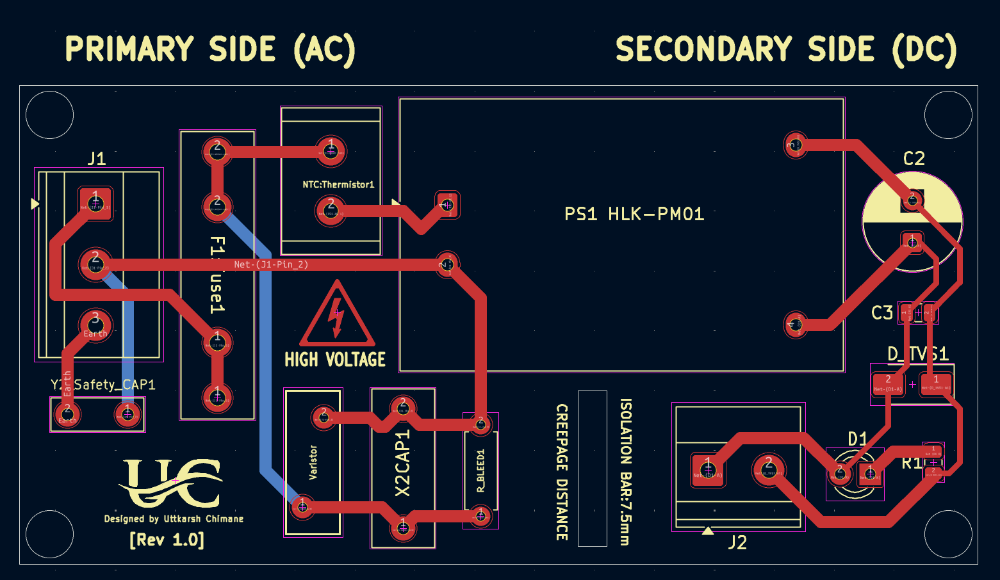
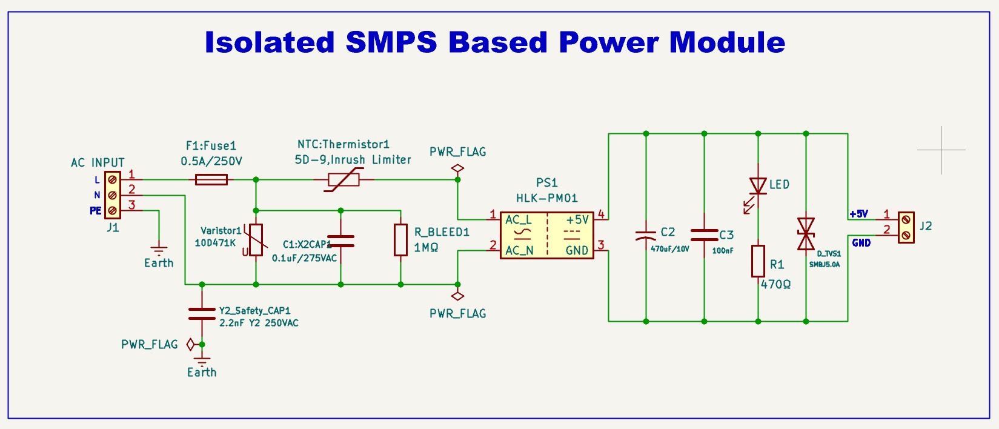

# ⚡Isolated AC-DC SMPS-Based Power Supply using HLK-PM01

A compact, isolated AC-to-DC Switch Mode Power Supply (SMPS) built around the HLK-PM01 module. The design incorporates comprehensive mains input protection, EMI suppression, primary-secondary galvanic isolation, and a regulated 5V DC output, making it suitable for embedded systems, IoT devices, and industrial electronics.

---

## 📖 Overview

This project presents the design of an **isolated 230VAC to 5VDC power supply** using the **HLK-PM01** AC-DC converter module. The objective was to develop a compact, safe, and reliable power supply suitable for powering embedded systems, microcontrollers, and IoT devices.

The design integrates the essential protection and filtering stages required for a mains-powered supply, including:

- **Input overcurrent protection** using a fuse
- **Inrush current limiting** using an NTC thermistor
- **Surge protection** using an MOV
- **EMI suppression** using X2 & Y2 safety capacitors and a bleeder resistor
- **Primary-secondary galvanic isolation**
- **Output filtering and transient protection** using electrolytic & ceramic capacitors and a TVS diode

---

## 📷 Project Gallery

🧩 **3D PCB Render**


🔌 **PCB Layout**



⚙️ **Schematic**



---

## ✨ Features

- 230VAC input, regulated 5V DC output (see [Specifications](#-specifications) for current rating)
- Isolated design (HLK-PM01 module)
- Fuse protection
- MOV surge protection
- NTC inrush current limiter
- X2 EMI suppression capacitor
- Y2 safety capacitor
- Bleeder resistor
- Output filtering capacitors (electrolytic + ceramic)
- TVS diode protection on the output rail
- LED power indicator
- Compact single-layer PCB
- 7.5 mm creepage/clearance barrier (basic isolation — see note below)
- ERC passed, DRC passed

---

## ⚒️ Hardware Architecture

```
230VAC Input
      │
      ▼
 Fuse Protection
      │
      ▼
NTC Thermistor
      │
      ▼
 MOV + X2 Capacitor
      │
      ▼
 HLK-PM01
(Isolated AC-DC Module)
      │
      ▼
Output Filter
(470µF + 100nF)
      │
      ▼
 TVS Protection
      │
      ▼
LED Indicator
      │
      ▼
5V DC Output
```

---

## 📐 Schematic Highlights

**Input protection**
- 0.5A fuse
- 5D-9 NTC thermistor
- MOV (10D471K)

**EMI suppression**
- X2 safety capacitor
- Y2 safety capacitor
- 1MΩ bleeder resistor

**Power conversion**
- HLK-PM01 isolated AC-DC module (230VAC in, 5V DC out)

**Output stage**
- 470µF electrolytic capacitor
- 100nF ceramic capacitor
- SMBJ5.0A TVS diode (clamps ~9.2V — chosen for fast transient suppression while keeping standoff comfortably above the 5V rail)
- LED status indicator

---

## 🧩 PCB Design Insights

- Designed in **KiCad 10**
- Single-layer PCB
- Primary-secondary isolation maintained throughout layout
- 7.5 mm creepage/clearance barrier — sized for **basic insulation** at this voltage/pollution degree; reinforced insulation per IEC 62368-1 typically calls for wider spacing, so treat this as basic-isolation-only unless re-verified against the applicable standard
- Thick power traces for mains current
- Compact component placement
- ERC: 0 errors
- DRC: 0 errors
- Custom silkscreen labels
- Mounting holes included

---

## 🧪 Applications

- ESP32 / Arduino projects
- IoT devices
- Embedded systems
- Home automation
- Sensor nodes
- Industrial monitoring
- Educational / prototype development

---

## ⚠️ Limitations

- Fixed 5V output
- Output power limited by the HLK-PM01 module's rating
- No short-circuit indicator
- No reverse polarity protection on the output
- No output fuse — input fuse protects against mains-side faults only, not secondary-side shorts
- Indoor use only
- Requires a proper enclosure for mains safety

---

## 🚀 Future Improvements

- Add output fuse
- Add reverse polarity protection
- Add power ON switch
- Add AC power LED
- Improve thermal management
- Add test points
- Add mounting labels
- Design a double-layer version
- Add IEC input connector
- Improve EMI filtering

---

## 📚 Learning Outcomes

- PCB design using KiCad
- AC-DC power supply design
- Electrical isolation concepts (creepage & clearance)
- Component footprint selection
- PCB routing techniques
- EMI suppression methods
- Mains safety practices
- Design Rule Check (DRC) and Electrical Rule Check (ERC)
- PCB 3D visualization

---

## 📊 Specifications

| **Parameter** | **Value** |
|:--------------|:----------|
| **Project** | Isolated 230VAC to 5VDC Power Supply using HLK-PM01 |
| **Input Voltage** | 230 VAC, 50 Hz |
| **Output Voltage** | 5 V DC |
| **Output Power** | 3 W |
| **Output Current** | Up to 600 mA |
| **AC-DC Module** | Hi-Link HLK-PM01 |
| **Input Protection** | 0.5 A Fuse, MOV (10D471K), 5D-9 NTC |
| **EMI Filter** | X2 Capacitor, Y2 Capacitor, 1 MΩ Bleeder |
| **Output Protection** | SMBJ5.0A TVS Diode |
| **Output Filter** | 470 µF + 100 nF Capacitors |
| **Isolation** | Galvanically Isolated (basic, 7.5 mm barrier) |
| **PCB** | Single-Layer FR-4 |
| **Design Software** | KiCad 10 |
| **ERC Status** | ✅ Passed (0 Errors) |
| **DRC Status** | ✅ Passed (0 Errors) |
| **Applications** | ESP32, Arduino, IoT, Embedded Systems |

---

## 👨‍💻 Author

**Uttkarsh Chimane**
- Electronics & Computer Engineering Student
- Designed using **KiCad 10**
